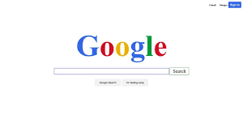

# Google Search Simulation Project

Welcome to the Google Search Simulation project! This project aims to replicate the basic functionality of Google's search engine, including regular search, image search, and advanced search features.

## Project Overview

Your website must meet the following requirements:

- Your website should have at least three pages: one for regular Google Search (index.html), one for Google Image Search, and one for Google Advanced Search.
- On the Google Search page, there should be links in the upper-right of the page to go to Image Search or Advanced Search. On each of the other two pages, there should be a link in the upper-right to go back to Google Search.
- On the Google Search page, the user should be able to type in a query, click “Google Search,” and be taken to the Google search results for that page.
- Like Google’s own, your search bar should be centered with rounded corners. The search button should also be centered and beneath the search bar.
- On the Google Image Search page, the user should be able to type in a query, click a search button, and be taken to the Google Image search results for that page.
- On the Google Advanced Search page, the user should be able to provide input for the following four fields (taken from Google’s own advanced search options)
  - Find pages with… “all these words:”
  - Find pages with… “this exact word or phrase:”
  - Find pages with… “any of these words:”
  - Find pages with… “none of these words:”
- Like Google’s own Advanced Search page, the four options should be stacked vertically, and all of the text fields should be left aligned.
- Consistent with Google’s own CSS, the “Advanced Search” button should be blue with white text.
- When the “Advanced Search” button is clicked, the user should be taken to the search results page for their given query.
- Add an “I’m Feeling Lucky” button to the main Google Search page. Consistent with Google’s own behavior, clicking this link should take users directly to the first Google search result for the query, bypassing the normal results page.
- You may encounter a redirect notice when using the “I’m Feeling Lucky” button. Not to worry! This is an expected consequence of a security feature implemented by Google.
- The CSS you write should resemble Google’s own aesthetics.

## Project Demo

Check out the project in action on YouTube: [Google Search Simulation Project Demo](https://youtu.be/p3zVO2WFjZE)

Feel free to explore the project and provide feedback. If you have any questions or suggestions, feel free to open an issue or reach out!

Happy coding! 🚀

Happy coding! 🚀
